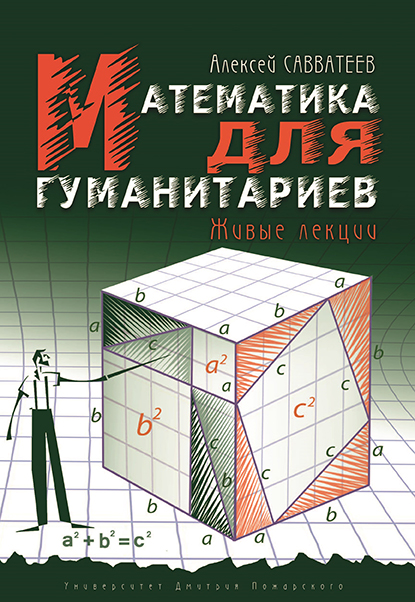

# Книга «Математика для гуманитариев»

Книга Алексея Савватеева «Математика для гуманитариев»
Книга, которую я предлагаю Вам прочитать, очень необычна — это лекции в режиме реального времени. Стиль повествования позволяет воссоздать атмосферу, царившую в аудитории, ведь на бумагу практически без шлифовки перенесены не только мои слова, но и догадки и комментарии слушателей. Именно такой концепцией обусловлен отказ от последовательного введения математических понятий. Переходя от сюжета слушателям (и читателям) в процессе беседы предлагаются все более логически сложные конструкции, подталкивающие освоению базовых понятий, построений и языка современной математики. Для понимания данной книги не тpебуется никакое начальное знание, однако человек, освоивший её целиком, сможет в дальнейшем читать более специальную литературу. 

С уважением,
Популяризатор математики,
доктор физико-математических наук,
ректор Университета Дмитрия Пожарского,
Алексей Савватеев

* [Купить](https://www.chitai-gorod.ru/catalog/book/994591/)
* Скачать книгу [PDF](book.pdf) (последняя версия книги)
* Скачать книгу [PDF](book-old.pdf) (предыдущая версия — с фотографиями)

## О книге:
> «Данная книга — один из наилучших способов потренировать забытые навыки даже тому, кому не приходилось со школьных времен решать сложные и красивые задачи. Читать же мы ее рекомендуем с карандашом в руках — она не предполагает пассивности; нужно сделать усилие ей навстречу — и оно будет богато вознаграждено».
>
> Доктор филологических наук А. И. Любжин

> «Книга А. Савватеева открывает читателю увлекательный мир интеллектуальных достижений. Людям, далеким от предмета и вынесшим о нем из школьной практики не самые лучшие впечатления, она позволит узнать, как математика может быть интересна, парадоксальна и… красива. Во всяком случае, «лирикам» ее следовало бы преподавать именно так».
>
> Доктор исторических наук С.В. Волков

> «Замечательная книга. В ней очень популярно, доходчиво и убедительно рассказывается, что такое математика и как прекрасно, когда есть "абсолютно непререкаемое доказательство". Думаю, она будет исключительно полезна для весьма широкого круга читателей. И особенно я бы рекомендовал ее тем, кто еще не открыл для себя настоящую математическую красоту. Она не в формулах, которые пугают, но в удивительно красивых, "строгих" рассуждениях. Только не ждите, что вам расскажут о практических приложениях математических результатов. Математика прекрасна изнутри, и именно в этом пафос книги».
>
> Доктор физико-математических наук А. М. Райгородский