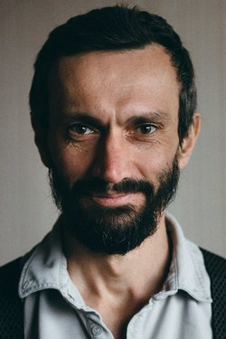

# Алексей Владимирович Савватеев

- доктор физико-математических наук
- профессор МФТИ
- профессор Адыгейского государственного университета
- научный руководитель Кавказского математического центра
- ведущий научный сотрудник ЦЭМИ РАН
- советник руководителя проекта "Школково"
- автор и ведущий лектор курса "100 уроков математики для детей"
- научный руководитель кружка «Настоящая математика» в Физтех-Лицее (г. Долгопрудный)
- научный руководитель Научного лектория Школы № 2107 (г. Москва)
- научный руководитель движения "Я - математик" в г. Нальчик
- руководитель Камского математического центра в г. Набережные Челны
- заместитель Генерального Директора по научным и образовательным программам ТД "Национальный Бренд"
- популяризатор математики среди детей и взрослых
- автор книги "Математика для гуманитариев"

[Кандидатская диссертация](disser.pdf)
